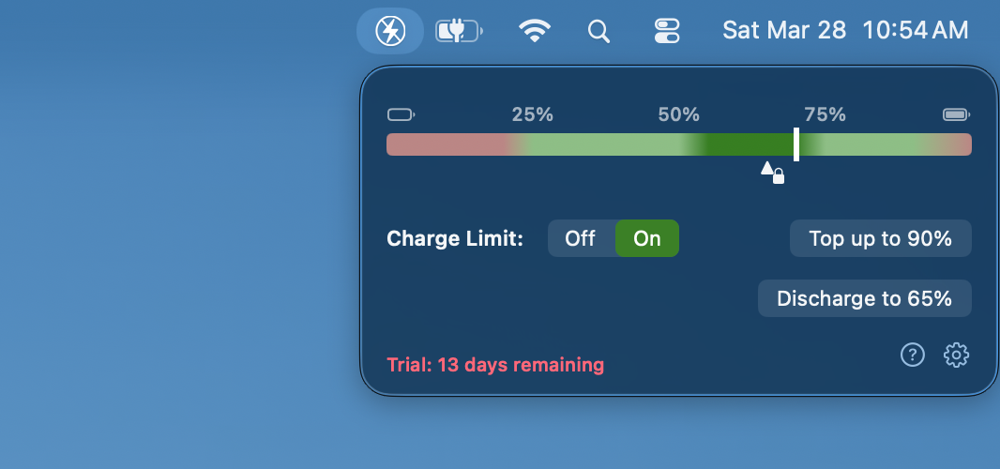

# BatteryThrottle-releases

BatteryThrottle for MacOS laptops. Free trial with license available on Gumroad.

# Why this app?

I’m a retired professor of battery chemistry so it annoys me to run my laptop off the A/C plug while watching my battery sit at a level that ages it unnecessarily. I wanted a simple one-click interface that does two things:

1. Make my battery sit at an optimum charge when I know I'll be plugged in for a while

2. Charge the pack to a higher (but still safe) level before traveling

                    My research career involved collaborations with future battery chemistries as well as currently popular ones, so I suggest optimum charge levels based on my best estimate of Apple's cell chemistry. I certainly wouldn't say that MacBooks use a bad battery management system, but there's no doubt you'll do better if you take direct control. The software can only guess at what you're going to do, and cannot be as good as you since you know what your plans are.

As Apple so often does, it tries to make the battery controls a little too automatic and that's not ideal if you're a savvy user. Even the new controls they are considering adding don't let you take full control. If you want to try getting that control back, give this app a free test for a couple weeks and see if you prefer it.

# Usage
The main interface is designed to be user friendly:
* The current battery level is shown as a vertical bar on the graphic.
* Turn charge limiting on or off with the toggle button.
* Set the target charge level by dragging the padlock left or right.
* If you plan to use your laptop on the go later on, click the top-up button once to rise to the higher travel target (set the limit in the configuration panel)
* If you know you won't travel for a very long time, click the discharge button once to discharge. Use this mode sparingly.
* You can set licensing, travel charge level, updates, and permissions on the configuration panel (click the gear icon).

Main app interface:

Report any issues you run across or features you'd like to see on this GitHub page.
